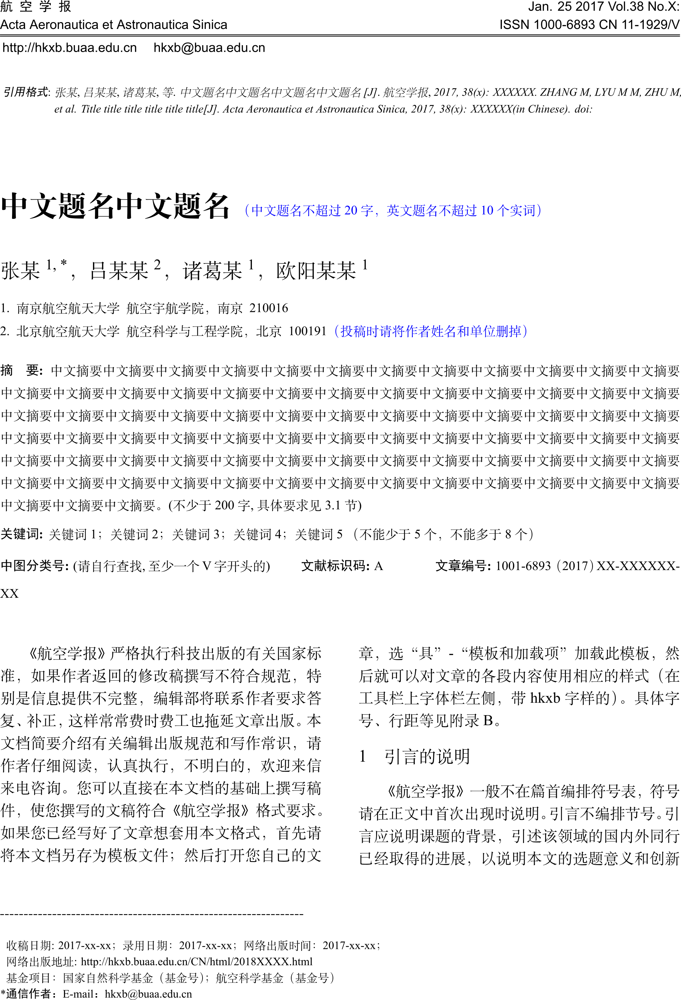
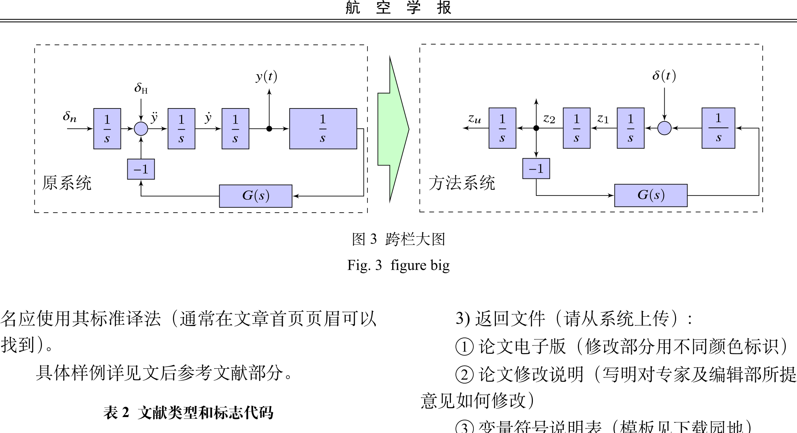

### 声明，我是先用这个模板写的论文，然后转成word，再用word生成pdf，然后投稿的。但是投稿过程发现不需要word文件，只需要pdf文件就行了，这点与北航学报是不同的，也就是说如果latex做的好的话，至少在投稿、初审、外审阶段是不需要word的，只要latex生成的pdf就行。

航空学报LaTeX模板（非官方）

LaTeX Template (unofficial) for Acta Aeronautica et Astronautica Sinica

模板是根据 “航空学报模板2017-07-20” word版改的，非官方。最终格式解释权在航空学报，本工作只作为参考。

aaas.cls 模板文件

cite.sty、GB.cpx 引用样式、中文支持相关文件（文件内有原作者信息；GB.cpx到底用到没，怎么用的我也不清楚，只是参考了控制理论与应用模板）

TempExample.tex 正文内容

TempExample.bib 参考文献

image 文件夹下是正文中用到的图片文件

在完整安装texlive 2017 或者 texlive 2018条件下，直接在命令行按顺序运行如下命令即可

xelatex TempExample.tex  
bibtex TempExample  
xelatex TempExample.tex  
xelatex TempExample.tex  

最终生成TempExample.pdf文件

#######################################################

Symbol 文件夹下是《变量符号说明》生成文档
增加了符号在文中的位置的信息，需要辅助文件TempExample.aux

